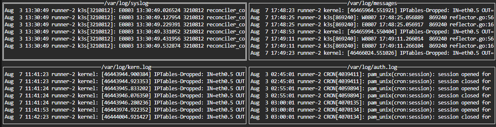
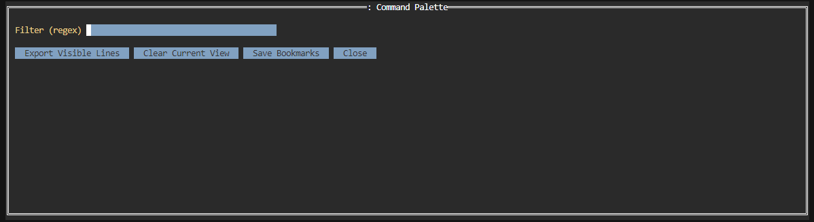

# Hyperbyte Logs

Terminal UI for tailing and exploring multiple log files side-by-side. Fast, keyboard-driven, and designed for power users.





## Features
- Multiple logs at once in a 2x2 grid (four corners)
- Paging for 4+ logs (previous/next page controls)
- Live regex filtering with dynamic updates
- Color highlighting for common levels (ERROR, WARN, INFO)
- Per-panel pause/resume
- Bookmarks per log and a selectable bookmarks list
- Command palette for filter/export/clear/bookmarks actions
- Status bar with page, focus, pause, and filter state
- Overlays (help, palette, etc.) suspend global hotkeys while active

## Install
- Requires Go 1.22+

Build a local binary:

```bash
go build ./...
```

Run directly:

```bash
go run . [LOG_FILE ...]
```

## Usage
Specify one or more log files:

```bash
./hyperbyte-logs /var/log/syslog /var/log/auth.log
```

If no files are specified, the app attempts common defaults and uses any that exist and are readable:
- /var/log/syslog
- /var/log/messages
- /var/log/kern.log
- /var/log/dmesg
- /var/log/auth.log
- /var/log/system.log
- /var/log/daemon.log

## Keybindings

| Key | Action |
|---|---|
| q | Quit |
| s | Toggle auto-scroll for the focused panel |
| c | Clear the focused panel view |
| h | Help |
| / | Regex filter prompt (leave empty to clear) |
| b | Bookmark last line in the focused log |
| B | Show bookmarks list for focused log |
| Tab | Switch focus across visible panels |
| [ | Previous page (if more than 4 logs) |
| ] | Next page (if more than 4 logs) |
| p | Pause/resume updates for the focused panel |
| : | Open command palette |

Notes:
- When an overlay/modal (help, command palette, export viewer, bookmarks, filter prompt) is open, global hotkeys are suspended until you close the overlay.

## Command Palette
- Filter (regex): Update the active filter live
- Export Visible Lines: Opens a read-only view containing currently visible (filtered) lines
- Clear Current View: Clears text of the focused panel
- Save Bookmarks: Saves current log's bookmarks to `bookmarks.txt`

## Color Highlighting
- ERROR or FATAL: red
- WARN or WARNING: orange
- INFO: light blue

## Project Structure
- `main.go`: CLI entrypoint and default log detection
- `internal/tlog`: Log tailing, bookmarking, exporting, simple persistence
- `internal/highlight`: Colorization rules
- `internal/ui`: TUI composition, paging, overlays, command palette, keybindings

## Development
Build:

```bash
go build ./...
```

Run tests:

```bash
go test ./...
```

Update dependencies:

```bash
go mod tidy
```

## Troubleshooting
- Colors not displaying: ensure your terminal supports 256 colors and `TERM` is set appropriately (e.g., `xterm-256color`).
- Permissions: some system logs may require elevated privileges.
- Large/rotated logs: files are followed and reopened on rotation; the in-memory buffer keeps the most recent 2000 lines per log panel.
